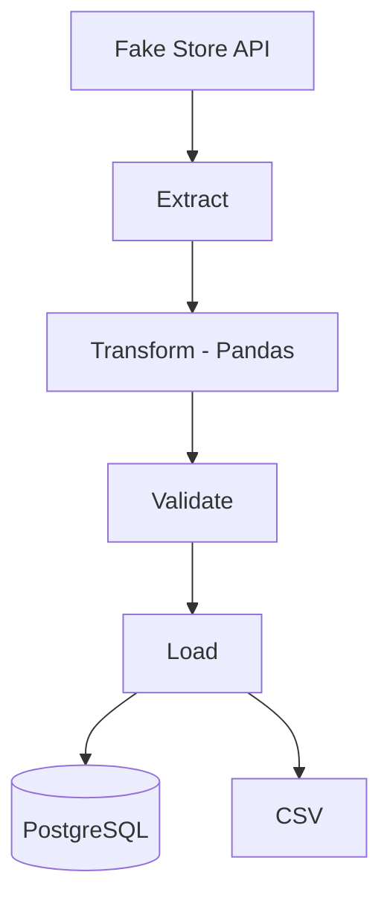
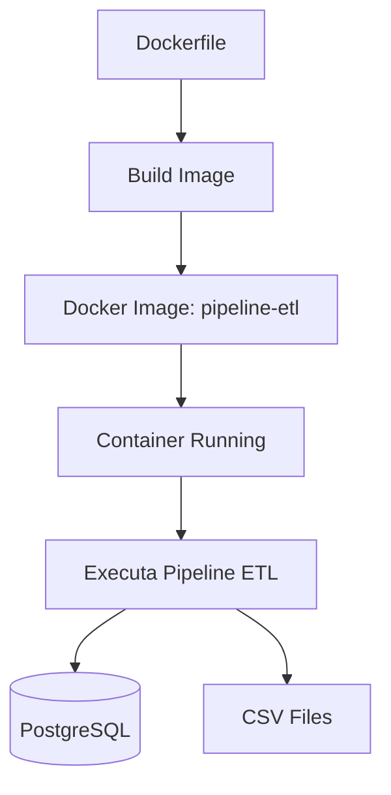

# 🚀 Pipeline ETL com Python


Pipeline ETL desenvolvido em Python para extração, transformação, validação e carga de dados em PostgreSQL, com Docker, Pytest e GitHub Actions.

## 📑 Sumário

- Sobre o projeto
- Tecnologias
- Arquitetura
- Como executar
- Testes
- Estrutura
- Resultados
- Objetivos
- Aprendizados
- Melhorias futuras

## 📌 Sobre o projeto

Este projeto implementa um pipeline ETL (Extract, Transform and Load) utilizando Python.

Os dados são extraídos da Fake Store API, transformados com Pandas, validados e armazenados tanto em arquivo CSV quanto em um banco de dados PostgreSQL.

O projeto foi desenvolvido com foco em boas práticas de Engenharia de Dados, incluindo:

- Arquitetura modular em camadas (Extract, Transform, Load)
- Configuração via variáveis de ambiente (.env)
- Logging estruturado
- Validação de dados antes da carga
- Separação entre dados brutos (raw) e tratados (processed)
- Tratamento de exceções

## ✨ Funcionalidades

O pipeline oferece as seguintes funcionalidades:

- Consumo de dados da Fake Store API
- Transformação e tratamento dos dados com Pandas
- Validação automática antes da carga
- Persistência dos dados em PostgreSQL
- Geração de arquivo CSV tratado
- Geração de logs estruturados da execução
- Configuração por variáveis de ambiente (`.env`)
- Execução local ou em containers Docker
- Testes automatizados com Pytest
- Integração contínua com GitHub Actions

## 🛠️ Tecnologias utilizadas

| Tecnologia | Finalidade |
|------------|------------|
| **Python 3.13** | Linguagem principal do projeto |
| **Pandas** | Transformação e tratamento dos dados |
| **Requests** | Consumo da API |
| **PostgreSQL** | Armazenamento dos dados |
| **Psycopg2** | Conexão entre Python e PostgreSQL |
| **Python-dotenv** | Gerenciamento das variáveis de ambiente |
| **Logging** | Registro de logs da execução |
| **Pytest** | Testes automatizados |
| **GitHub Actions** | Integração contínua (CI) |
| **Git** | Controle de versão |
| **Docker** | Containerização do ambiente |

## 🏗️ Arquitetura do Pipeline


## 🐳 Docker



## ⚙️ Como executar o projeto

### 1. Clone o repositório

```bash
git clone https://github.com/isabelleferreiraa/pipeline-etl-vendas.git
```

### 2. Entre na pasta do projeto

```bash
cd pipeline-etl-vendas
```

### 3. Configure as variáveis de ambiente

O projeto pode ser executado de duas formas: **localmente** ou utilizando **Docker**.

#### Execução Local

Crie um arquivo `.env` na raiz do projeto utilizando o `.env.example` como modelo:

```env
# Configure as credenciais do seu banco de dados

DB_HOST=localhost
DB_NAME=etl_vendas
DB_USER=postgres
DB_PASSWORD=sua_senha
DB_PORT=5432
```

#### Execução com Docker

Crie um arquivo `.env.docker` utilizando o `.env.docker.example` como modelo:

```env
# Configuração utilizada pelo Docker

DB_HOST=postgres
DB_NAME=etl_vendas
DB_USER=postgres
DB_PASSWORD=postgres
DB_PORT=5432
```

---

## ▶️ Opção 1 — Execução Local

### Crie o ambiente virtual

```bash
python -m venv .venv
```

### Ative o ambiente virtual

**Windows (PowerShell):**

```powershell
.\.venv\Scripts\Activate.ps1
```

**Windows (CMD):**

```cmd
.venv\Scripts\activate
```

### Instale as dependências

```bash
pip install -r requirements.txt
```

### Execute o pipeline

```bash
python -m src.main
```

---

## 🐳 Opção 2 — Execução com Docker

Certifique-se de que o Docker Desktop esteja em execução.

### Construa e execute os containers

```bash
docker compose up --build
```

Ou, para executar em segundo plano:

```bash
docker compose up -d
```

O Docker irá automaticamente:

- Criar o container do PostgreSQL;
- Executar o script `database/init.sql`;
- Aguardar o banco de dados ficar disponível (Health Check);
- Construir a imagem da aplicação;
- Executar o pipeline ETL;
- Inserir os dados no PostgreSQL;
- Gerar o arquivo CSV tratado;
- Gerar os logs da execução.

## 🧪 Executando os testes

Para executar todos os testes do projeto:

```bash
pytest
```

Ou, para visualizar mais detalhes da execução:

```bash
pytest -v
```

## 📂 Estrutura do projeto

```text
pipeline-etl-vendas/
│
├── .github/
│   └── workflows/
│       └── python-tests.yml
│
├── data/
│   ├── processed/
│   └── raw/
│
├── database/
│   └── init.sql
│
├── logs/
│   └── pipeline.log
│
├── src/
│   ├── __init__.py
│   ├── config.py
│   ├── extract.py
│   ├── load.py
│   ├── logger.py
│   ├── main.py
│   ├── transform.py
│   └── validate.py
│
├── tests/
│   ├── __init__.py
│   ├── conftest.py
│   ├── test_extract.py
│   ├── test_load.py
│   ├── test_transform.py
│   └── test_validate.py
│
├── .dockerignore
├── .env.example
├── .env.docker.example
├── .gitignore
├── docker-compose.yml
├── Dockerfile
├── LICENSE
├── README.md
└── requirements.txt
```

## 📊 Resultado

Ao final da execução do pipeline são gerados:

- ✅ Arquivo JSON bruto em `data/raw/produtos_raw.json`
- ✅ Arquivo CSV tratado em `data/processed/produtos_tratados.csv`
- ✅ Inserção dos dados na tabela `produtos` do PostgreSQL
- ✅ Logs estruturados da execução em `logs/pipeline.log`
- ✅ Validação dos dados antes da carga no banco
- ✅ Execução automatizada via Docker e Docker Compose
- ✅ Testes automatizados com Pytest
- ✅ Integração contínua (CI) com GitHub Actions

## 🎯 Objetivo do projeto

Desenvolver um pipeline ETL completo aplicando boas práticas de Engenharia de Dados, incluindo ingestão de dados via API, transformação com Pandas, validação, persistência em PostgreSQL, containerização com Docker, testes automatizados e integração contínua com GitHub Actions.

## 💡 Aprendizados

- Construção de pipelines ETL do zero
- Integração Python + PostgreSQL
- Manipulação e limpeza de dados com Pandas
- Estruturação de projeto em camadas
- Boas práticas de engenharia de software aplicadas à dados
- Containerização de aplicações com Docker
- Escrita de testes automatizados com Pytest
- Configuração de integração contínua com GitHub Actions

## 🔮 Melhorias futuras

- Orquestração do pipeline com Apache Airflow
- Armazenamento analítico em Data Warehouse
- Versionamento de dados com Delta Lake
- Dashboard para monitoramento da execução

## 👨‍💻 Autora

 **Isabelle Ferreira Neri Feitoza**
  
 Estudante de Análise e Desenvolvimento de Sistemas — FIAP  
 RM 573507 | Turma: 1TDSPH

  * [LinkedIn](https://www.linkedin.com/in/isabelle-ferreira-8844593ab/) | [GitHub](https://github.com/isabelleferreiraa)


