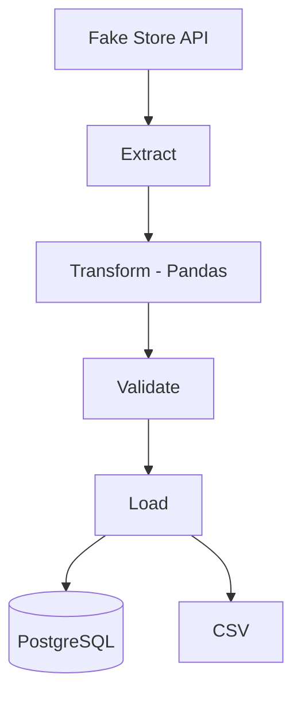
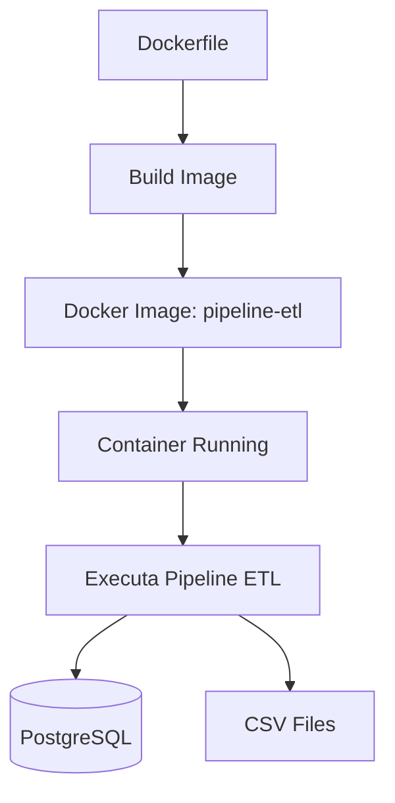

# 🚀 Pipeline ETL com Python


Pipeline ETL desenvolvido em Python para extração, transformação e carregamento de dados da Fake Store API, utilizando Pandas e PostgreSQL.

## 📌 Sobre o projeto

Este projeto implementa um pipeline ETL (Extract, Transform and Load) utilizando Python.

Os dados são extraídos da Fake Store API, transformados com Pandas, validados e armazenados tanto em arquivo CSV quanto em um banco de dados PostgreSQL.

O projeto foi desenvolvido com foco em boas práticas de Engenharia de Dados, incluindo:

- Arquitetura modular em camadas (Extract, Transform, Load)
- Configuração via variáveis de ambiente (.env)
- Logging estruturado
- Validação de dados antes da carga
- Separação entre dados brutos (raw) e tratados (processed)
- Tratamento de exceções

## 🛠️ Tecnologias utilizadas

| Tecnologia | Finalidade |
|------------|------------|
| **Python 3** | Linguagem principal do projeto |
| **Pandas** | Transformação e tratamento dos dados |
| **Requests** | Consumo da API |
| **PostgreSQL** | Armazenamento dos dados |
| **Psycopg2** | Conexão entre Python e PostgreSQL |
| **Python-dotenv** | Gerenciamento das variáveis de ambiente |
| **Logging** | Registro de logs da execução |
| **Git** | Controle de versão |
| **Docker** | Containerização do ambiente |

## 🏗️ Arquitetura do Pipeline


## 🐳 Docker



## ⚙️ Como executar o projeto

### 1. Clone o repositório

```bash
git clone https://github.com/isabelleferreiraa/pipeline-etl-vendas.git
```

### 2. Entre na pasta do projeto

```bash
cd pipeline-etl-vendas
```

### 3. Configure as variáveis de ambiente

O projeto pode ser executado de duas formas: **localmente** ou utilizando **Docker**.

#### Execução Local

Crie um arquivo `.env` na raiz do projeto utilizando o `.env.example` como modelo:

```env
# Configure as credenciais do seu banco de dados

DB_HOST=localhost
DB_NAME=etl_vendas
DB_USER=postgres
DB_PASSWORD=****
DB_PORT=5432
```

#### Execução com Docker

Crie um arquivo `.env.docker` utilizando o `.env.docker.example` como modelo:

```env
# Configuração utilizada pelo Docker

DB_HOST=postgres
DB_NAME=etl_vendas
DB_USER=postgres
DB_PASSWORD=****
DB_PORT=5432
```

---

## ▶️ Opção 1 — Execução Local

### Crie o ambiente virtual

```bash
python -m venv .venv
```

### Ative o ambiente virtual

**Windows (PowerShell):**

```powershell
.\.venv\Scripts\Activate.ps1
```

**Windows (CMD):**

```cmd
.venv\Scripts\activate
```

### Instale as dependências

```bash
pip install -r requirements.txt
```

### Execute o pipeline

```bash
python src/main.py
```

---

## 🐳 Opção 2 — Execução com Docker

Certifique-se de que o Docker Desktop esteja em execução.

### Construa e execute os containers

```bash
docker compose up --build
```

Ou, para executar em segundo plano:

```bash
docker compose up -d
```

O Docker irá automaticamente:

- Criar o container do PostgreSQL;
- Executar o script `database/init.sql`;
- Aguardar o banco de dados ficar disponível (Health Check);
- Construir a imagem da aplicação;
- Executar o pipeline ETL;
- Inserir os dados no PostgreSQL;
- Gerar o arquivo CSV tratado;
- Gerar os logs da execução.

## 📂 Estrutura do projeto

```text
pipeline-etl-vendas/
│
├── data/
│   ├── raw/
│   └── processed/
│
├── database/
│   └── init.sql
│
├── logs/
│
├── src/
│   ├── config.py
│   ├── extract.py
│   ├── transform.py
│   ├── validate.py
│   ├── load.py
│   ├── logger.py
│   └── main.py
│
├── tests/
│
├── .dockerignore
├── .env.example
├── .gitignore
├── docker-compose.yml
├── Dockerfile
├── LICENSE
├── README.md
└── requirements.txt
```

## 📊 Resultado

Após a execução do pipeline são gerados:

- JSON bruto em `data/raw/produtos_raw.json`
- CSV tratado em `data/processed/produtos_tratados.csv`
- Logs da execução em `logs/pipeline.log`
- Dados persistidos no PostgreSQL

## 🎯 Objetivo do projeto

Aplicar conceitos de Engenharia de Dados, incluindo ingestão de dados via API, processamento com Pandas, validação, persistência em banco de dados e organização em um pipeline ETL modular.

## 💡 Aprendizados

- Construção de pipelines ETL do zero
- Integração Python + PostgreSQL
- Manipulação e limpeza de dados com Pandas
- Estruturação de projeto em camadas
- Boas práticas de engenharia de software aplicadas à dados

## 🔮 Melhorias futuras

- Pipeline orquestrado com Apache Airflow
- Testes automatizados com Pytest
- Integração contínua com GitHub Actions
- Data Warehouse para armazenamento analítico

## 👨‍💻 Autora

 **Isabelle Ferreira Neri Feitoza**
  
 Estudante de Análise e Desenvolvimento de Sistemas — FIAP  
 RM 573507 | Turma: 1TDSPH

  * [LinkedIn](https://www.linkedin.com/in/isabelle-ferreira-8844593ab/) | [GitHub](https://github.com/isabelleferreiraa)


